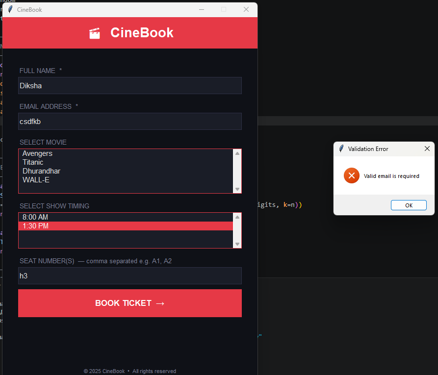
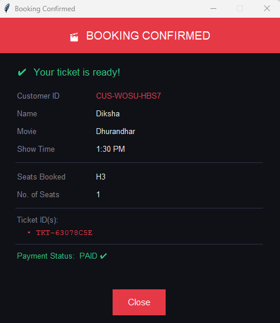

🎬 CineBook – Movie Ticket Booking System

CineBook is a desktop-based Movie Ticket Booking System built using Python, Tkinter, and MySQL.
It allows users to select movies, choose show timings, book multiple seats, and generate unique ticket IDs with real-time seat validation.

✨ Features
👤 User registration with name and email
🆔 Automatic Customer ID generation
🎟️ Unique Ticket ID generation
🎬 Movie selection from database
⏰ Show timing selection
💺 Multiple seat booking support
🚫 Duplicate seat booking prevention
📧 Email validation (@ check)
⚡ Real-time seat availability check
💳 Payment status tracking (default: Paid)
🎉 Booking confirmation popup UI
🗄️ MySQL database integration
🎨 Modern dark-themed GUI using Tkinter

🛠️ Technologies Used
Python
Tkinter (GUI)
MySQL Database
mysql-connector-python
UUID (for ticket ID generation)
Random & String (for customer ID)

📂 Project Structure

CineBook/
│
├── main.py
├── database.sql
├── README.md
├── requirements.txt
├── .gitignore
│
└── screenshots/
    ├── home_screen.png
    ├── email_validation.png
    ├── seat_validation.png
    └── booking_confirmation.png

🗄️ Database Setup
Open MySQL
Create database:
CREATE DATABASE theatre_db;
USE theatre_db;
Run the provided database.sql file

This will create:
users table
movies table
shows table
tickets table

🚀 Installation & Run
1. Install required library
pip install mysql-connector-python
2. Configure database connection

Update this in main.py:

def get_connection():
    return mysql.connector.connect(
        host="localhost",
        user="root",
        password="YOUR_PASSWORD",
        database="YOUR DATABASE"
    )

3. Run the project
python main.py

📸 Screenshots

🏠 Home Screen

📧 Email Validation

Prevents invalid email formats.

💺 Seat Avalibility Validation

Prevents booking the same seat twice for the same show.

🎉 Booking Confirmation

Displays Customer ID, Ticket ID, and booking details.

🔒 Validation Features
Email must contain @
Seat cannot be booked twice for same show
Empty fields are not allowed
Multiple seat input supported (A1, A2, B3)

📌 Future Improvements
🎭 Seat layout UI (graphical seats)
📩 Email ticket confirmation
📄 PDF ticket generation
🔍 Ticket search system
❌ Ticket cancellation feature
👨‍💼 Admin dashboard
👨‍💻 Author

Made as a first Python + MySQL project using Tkinter GUI.

📄 License

This project is for educational purposes only.

## Screenshots

### Home Screen

### Email Validation

Shows an error when an invalid email is entered.

### Seat Availability Validation

Prevents booking the same seat twice for the same show.

### Booking Confirmation

Displays the generated Customer ID and Ticket ID after successful booking.

